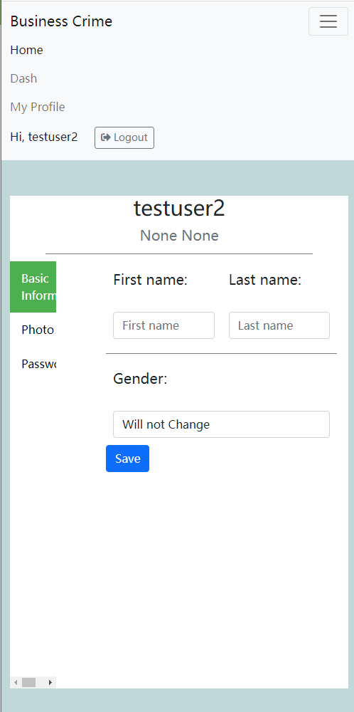
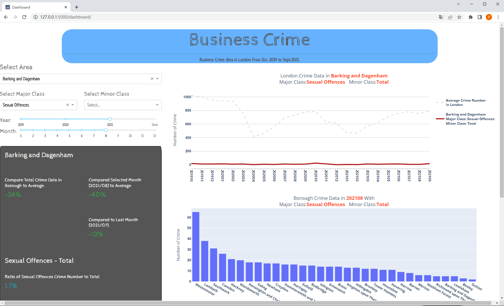
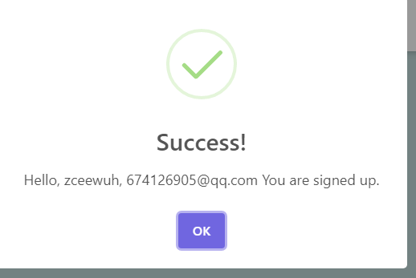
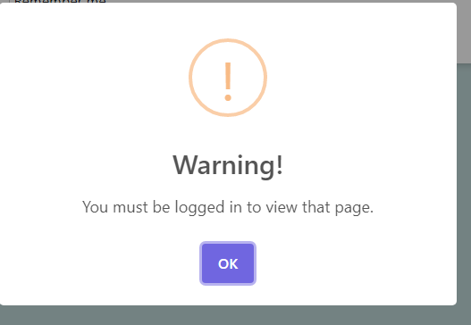
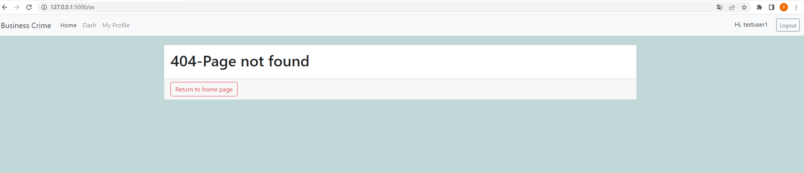

# Coursework 2
### Repository URL
[Repository](https://github.com/Kaguramio674/flaskProject.git)

### Test accounts
|  email   | password  | comment |
|  ----  | ----  | ----|
| 674126905@qq.com  | Tt001530! | personal account, fully customized
| 12345@mail.com | Aa12345! |Test user1
|123456@mail.com|Aa12345!|Test user2

### Targets:

####Responsive design

- tested with thin pages. For example:

####Dash app route

####User account
- /dash and /user/<username> can not be accessed without login. Automatically redirect to the login form.
- After login, buttons in the top right corner will change to Username and Logout button.

####Database
- dynamic url for user profile. /user/<username>
- store data in database, and changed easily.
- Lots of user data can be seen on profile page. (Will be listed in next section)

##Additional feature - User profiles

####1.Easily upload user photos, program can automatically rename the file with total 9000000 naming space. Users are not required to worry about program crushed due to same-name files.  
####2.Every user got a default photo when they registered.
####3.Allowed users change first/last name, gender and password. Different users will receive different gender icons, presented on the side of the profile.
####4.Database will record the register time, and displayed on the profile page with format “Joined XX Days XX Hours ago”.

##Other point 

####1.Beautiful windowed messages.

####2.Customized error information

####3.User list

####4.Follows
- Because I'm only required to finish one additional function -- profile, so I did not pay lots of attention on it. I add the fans number and follow button on the profile page. The function for it is not completed.

## References
[1] Dev-Elie, SweetAlert Js with Flask   https://github.com/Dev-Elie/SweetAlert-Js-with-Flask
[2] SQLAlchemy 1.3 Documentation  https://docs.sqlalchemy.org/en/13/orm/basic_relationships.html#one-to-one
[3] Fontawesome icons https://fontawesome.com/icons